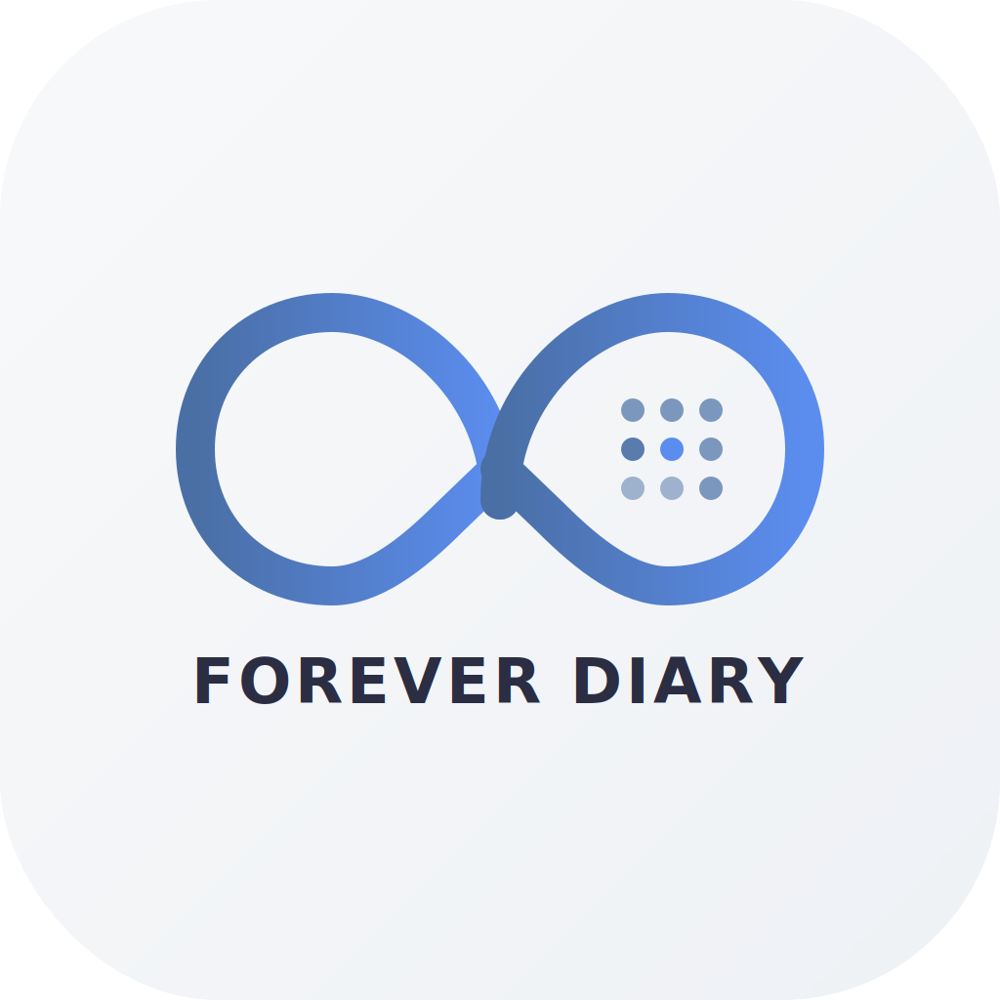

<p align="center">
  
</p>

<h1 align="center">Forever Diary</h1>

<p align="center">
  A beautifully crafted iOS diary app that layers your entries by date across years — so you can revisit what you wrote on this day, every year, forever.
</p>

<p align="center">
  
  
  
  
  
</p>

---

## Overview

Forever Diary reimagines journaling around a simple idea: **every day has a story that grows across years**. Instead of a linear timeline, entries are organized by month and day — open March 10th and see what you wrote on that date in 2024, 2025, 2026, and beyond.

### Key Features

- **Write-first experience** — Open the app and start typing immediately. Auto-save with debounce ensures nothing is lost.
- **Yearless calendar** — Browse by month and day, not by year. Tap any day to see a timeline of entries stacked across years.
- **Daily check-ins** — Track habits like mood, gratitude, exercise, sleep, and weight with customizable boolean, text, and number fields.
- **Photo attachments** — Attach up to 10 photos per entry with compression, thumbnails, and full-screen viewing.
- **Location tagging** — Automatically tag entries with your location via reverse geocoding.
- **Analytics dashboard** — View streaks (current and longest), completion rates, and habit trends via Swift Charts.
- **Offline-first cloud sync** — SwiftData is the source of truth. Entries sync to AWS (DynamoDB + S3) in the background when connected.
- **Anonymous authentication** — No sign-up required. AWS Cognito Identity Pool provides seamless anonymous auth.

## Architecture

```
┌─────────────────────────────────────────────────┐
│                   iOS App                       │
│  ┌───────────┐  ┌───────────┐  ┌────────────┐  │
│  │  SwiftUI  │  │ SwiftData │  │  Services  │  │
│  │   Views   │──│  Models   │──│ Sync/Auth  │  │
│  └───────────┘  └───────────┘  └─────┬──────┘  │
│                                      │         │
└──────────────────────────────────────┼─────────┘
                                       │
                              SigV4-signed HTTPS
                                       │
┌──────────────────────────────────────┼─────────┐
│                  AWS Cloud           │         │
│  ┌──────────┐  ┌──────────┐  ┌──────┴──────┐  │
│  │ Cognito  │  │ DynamoDB │  │ API Gateway │  │
│  │ Identity │  │  Tables  │  │  + Lambda   │  │
│  └──────────┘  └──────────┘  └─────────────┘  │
│                ┌──────────┐                    │
│                │    S3    │                    │
│                │  Photos  │                    │
│                └──────────┘                    │
└────────────────────────────────────────────────┘
```

### Data Model

Entries use a `(monthDayKey, year)` composite key — this is the foundation that enables the "on this day" experience:

| Model | Purpose |
|-------|---------|
| `DiaryEntry` | Core entry with text, location, date, and relationships to check-ins/photos |
| `CheckInTemplate` | Configurable field definitions (mood, exercise, etc.) |
| `CheckInValue` | Per-entry values for each check-in field |
| `PhotoAsset` | Photo metadata with compressed image data and thumbnails |

### Sync Strategy

1. **SwiftData is always the source of truth** — the app works fully offline
2. On connectivity, `SyncService` pushes local changes to DynamoDB/S3 via Lambda
3. Anonymous Cognito credentials are stored in Keychain
4. Photos upload to S3 with presigned URLs; metadata syncs via DynamoDB
5. Batch operations capped at 100 items with exponential backoff on failures

## Project Structure

```
ForeverDiary/
├── App/
│   └── ForeverDiaryApp.swift        # Entry point, container setup, sync init
├── Models/
│   ├── DiaryEntry.swift             # @Model — core diary entry
│   ├── CheckInTemplate.swift        # @Model — check-in field definitions
│   ├── CheckInValue.swift           # @Model — per-entry check-in data
│   ├── CheckInFieldType.swift       # Enum: boolean, text, number
│   └── PhotoAsset.swift             # @Model — photo attachment metadata
├── Views/
│   ├── ContentView.swift            # Root tab navigation
│   ├── Home/HomeView.swift          # Today's entry (write-first)
│   ├── Entry/EntryDetailView.swift  # Full entry view with all fields
│   ├── Calendar/
│   │   ├── CalendarBrowserView.swift # Month carousel + day grid
│   │   └── TimelineView.swift       # Year-stacked entries for a date
│   ├── Analytics/AnalyticsView.swift # Streaks, charts, completion stats
│   └── Settings/SettingsView.swift  # Templates, sync status, data export
├── Services/
│   ├── SyncService.swift            # Offline-first sync orchestrator
│   ├── APIClient.swift              # SigV4-signed API Gateway requests
│   ├── CognitoAuthService.swift     # Anonymous Cognito authentication
│   ├── AWSConfig.swift              # AWS region, endpoints, pool IDs
│   ├── KeychainHelper.swift         # Secure credential storage
│   ├── LocationService.swift        # CLLocationManager wrapper
│   └── TemplateSeedService.swift    # Default check-in template seeding
├── Assets.xcassets/                 # Colors, app icon, image assets
├── Info.plist                       # Privacy usage descriptions
└── ForeverDiary.entitlements        # App capabilities

ForeverDiaryTests/                   # 58 XCTest unit tests
aws/lambda/                          # Node.js Lambda (DynamoDB + S3 operations)
```

## Requirements

- **Xcode** 16.0+
- **iOS** 17.0+
- **Swift** 5.9+
- [XcodeGen](https://github.com/yonaskolb/XcodeGen) (for project generation)

## Getting Started

### 1. Clone the repository

```bash
git clone https://github.com/kennethsolomon/forever-diary.git
cd forever-diary
```

### 2. Generate the Xcode project

The `.xcodeproj` is generated from `project.yml` using XcodeGen. Do not edit it directly.

```bash
brew install xcodegen   # if not installed
xcodegen generate
```

### 3. Open and run

```bash
open ForeverDiary.xcodeproj
```

Select an iOS 17+ simulator and press **Cmd+R**.

### 4. AWS backend (optional)

The app works fully offline without AWS. To enable cloud sync:

1. Set up a Cognito Identity Pool (unauthenticated access)
2. Create a DynamoDB table and S3 bucket
3. Deploy the Lambda function from `aws/lambda/`
4. Update `ForeverDiary/Services/AWSConfig.swift` with your resource IDs

## Running Tests

```bash
xcodebuild test \
  -scheme ForeverDiary \
  -destination 'platform=iOS Simulator,name=iPhone 16'
```

All 58 tests cover models, services, sync logic, and cloud integration.

## Privacy & Permissions

Forever Diary requests the following permissions, only when needed:

| Permission | Usage |
|------------|-------|
| **Location (When In Use)** | Tag diary entries with where you were |
| **Photo Library** | Attach existing photos to entries |
| **Camera** | Take new photos to attach to entries |

No data is collected without user action. All data stays on-device unless cloud sync is explicitly enabled.

## Security

- Anonymous authentication — no email, password, or personal info required
- Credentials stored in iOS Keychain (not UserDefaults)
- All API requests signed with SigV4
- Lambda validates and sanitizes all input; strips user-controlled partition keys to prevent IDOR
- Photo uploads validated against 10MB size limit
- Sync batch sizes capped to prevent abuse
- Error logs never expose credentials or tokens

## Contributing

Contributions are welcome. Please follow these guidelines:

1. Fork the repository
2. Create a feature branch (`git checkout -b feat/your-feature`)
3. Use [conventional commits](https://www.conventionalcommits.org/) (`feat:`, `fix:`, `docs:`, etc.)
4. Ensure all tests pass before submitting
5. Open a pull request with a clear description

## License

This project is proprietary. All rights reserved.

---

<p align="center">
  Built with SwiftUI and SwiftData
</p>
